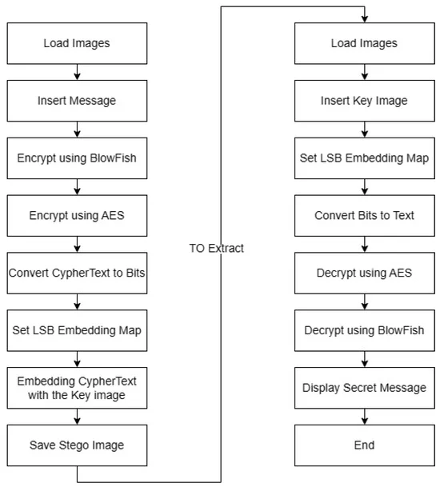

# Implemting Image Steganography Using LSB and Hybrid Encryption Algorithms

## Project Description

This project implements an advanced image steganography technique that combines the Least Significant Bit (LSB) method with hybrid encryption algorithms. The goal is to provide a secure and efficient way to hide secret messages within BMP image files while maintaining the visual integrity of the carrier image.

### The Encryption Pipeline
1. Apply Blowfish encryption to the the message.
2. Apply AES (Advanced Encryption Standard) encryption to the now Blowfish encrypted message.
3. Convert the secret message into binary format and compress the secret message to reduce its size.
4. Set LSB Embedding Map.



Key aspects of the project include:

1. Efficient BMP image processing for reading and writing files
2. Implementation of the LSB steganography algorithm
3. Integration of hybrid encryption techniques for message security
4. Minimal impact on image quality to avoid detection
5. User-friendly interface for encoding and decoding operations

This implementation serves as a practical application of cutting-edge research in the field of information hiding and cryptography, offering a powerful tool for secure communication through digital images.

## Features

- Read and write BMP image files
- Encode secret messages into BMP images
- Decode hidden messages from BMP images
- Minimal impact on the visual quality of the image

## Requirements

- C++ compiler (C++11 or later recommended)
- Standard C++ libraries

## Installation

1. Clone the repository:
   ```
   git clone https://github.com/yourusername/LSB_Image_Steganography.git
   ```
2. Navigate to the project directory:
   ```
   cd LSB_Image_Steganography
   ```

## Usage

To compile the program, use the following command: